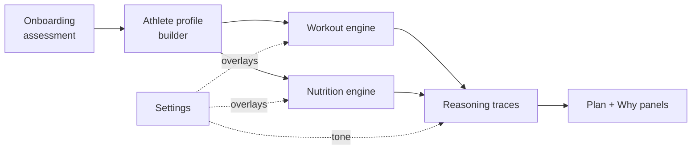

<!--
  Maintainer notes:
  • Add a live demo link below the title once deployed (Vercel).
  • Drop UI screenshots into docs/screenshots/ and embed them in the Screenshots section.
-->

<div align="center">

# WEDXUI FIT

### Training and nutrition that reasons — and explains every decision it makes.

An AI-powered fitness platform that builds you a workout split and a meal plan from your
physique goal, equipment, recovery, and lifestyle — then shows its work for every set,
rep, and calorie. No black boxes, no fake dashboards.

[](https://nextjs.org/)
[](https://www.typescriptlang.org/)
[](https://www.prisma.io/)
[](https://neon.tech/)
[](https://tailwindcss.com/)
[](#-progressive-web-app)

</div>

---

## Why it's different

Most fitness apps hand you a plan and never say why. WEDXUI FIT is built on a
**deterministic, knowledge-driven engine — not an LLM wrapper** — so every recommendation
is reproducible, auditable, and comes with a plain-English rationale.

> _"Overhead Press fills the vertical-push slot: your equipment (dumbbells) allows it, and
> it serves the athletic physique under hypertrophy training."_ — an actual reasoning line
> the engine renders.

Three principles run through the whole codebase:

- **No fake functionality.** Every control persists to Postgres *and* changes real behavior. A toggle that does nothing is a bug, not a placeholder.
- **Explainability by construction.** Each engine decision is a `{ rule, inputs }` object rendered to prose, so the "Why?" panel is never hand-written marketing copy — it's the actual decision trace.
- **Honest state.** Stats are real user data. When something isn't wired end-to-end, it isn't shipped.

---

## Features

### 🧠 The intelligence layer
- **Athlete profiling** — synthesizes a recovery score (sleep, stress, occupation), training capacity, budget tier (inferred from food habits), and diet flags from a 7-step onboarding assessment.
- **Workout engine** — selects split templates, fills movement-pattern slots against your real equipment, and assigns sets / reps / rest / progression per exercise — capping volume to what your recovery and session length actually allow.
- **Nutrition engine** — Mifflin–St Jeor BMR, goal-adjusted calories with safety floors, full macro split, meal construction from foods you already eat, and supplement suggestions matched to budget.
- **Every decision explained** — reasoning traces render in the plan, the exercise cards, and the onboarding reveal, in a tone you control (short / detailed / scientific).

### 🏋️ Training & tracking
- Live workout sessions with a configurable rest timer, activity heartbeat, and set logging.
- Streak / XP / level progression and achievement unlocks computed server-side in a single transaction.
- Real-data progress rings (XP to next level, sessions this week, current streak).
- A library of 40 exercises with movement patterns, progressions, and substitutions.
- 14 fitness calculators (BMR, TDEE, 1RM, body-fat, lean mass, macros, and more).

### ⚙️ Settings that actually do something
A full settings system across **seven domains** — every field reaches back into the app:

| Domain | Wired to |
| --- | --- |
| **Workout** | Rest timer, session length, training days, equipment, difficulty → the plan engine |
| **Diet** | Diet type, allergies, water goal, meals/day, budget → the nutrition engine |
| **AI Coach** | Tone & explanation depth → the reasoning renderer, live |
| **Appearance** | Accent, font size, glass blur, corners, compact, reduced-motion → live CSS variables |
| **Privacy / Notifications / Account** | Persisted preferences + timezone-aware day boundaries |

Autosave with debounce, optimistic UI with rollback, skeletons, and toasts throughout.

### 🔐 Security, done for real
- **Two-factor auth (TOTP)** — QR enrollment, secrets **encrypted at rest with AES-256-GCM** (key derived from `JWT_SECRET` via scrypt), never stored in plaintext.
- **Recovery codes** — shown exactly once, stored only as bcrypt hashes, regenerable.
- **Device / session management** — see every signed-in session, revoke individually or all-but-current.
- **Activity audit log** — password changes, 2FA events, device revocations, settings updates.
- **Data export** — a full JSON download of your own data, with credentials deliberately excluded.
- **Account deletion** — a 30-day grace window you can cancel, backed by a **cron job that actually purges** matured requests (not a button that lies).
- **Security score** — a real 0–100 posture rating driven by account state, not vibes.

---

## Tech stack

**Next.js 14** (App Router) · **TypeScript** · **Tailwind CSS** · **Framer Motion** · **Zustand**
**Prisma** ORM · **Neon** serverless PostgreSQL · custom **bcrypt + JWT** auth (`jose`) · **otplib** TOTP · **Zod** validation

A **modular monolith**: the service layer is separated from the API routes so it can be
extracted later, without the overhead of microservices today. Authentication is custom
(no NextAuth) — bcrypt-hashed passwords, DB-backed sessions, and edge-verified JWTs in
middleware.



---

## Getting started

### Prerequisites
- Node.js 18+
- A PostgreSQL database (a free [Neon](https://neon.tech) project works out of the box)

### 1. Install
```bash
git clone https://github.com/divyesh8/wedxui-fit.git
cd wedxui-fit
npm install
```

### 2. Configure environment
```bash
cp .env.example .env
```
Fill in `.env`:

| Variable | Purpose |
| --- | --- |
| `DATABASE_URL` | Pooled Neon connection (host contains `-pooler`) — used by the app |
| `DIRECT_URL` | Direct Neon connection — used by `prisma migrate` |
| `JWT_SECRET` | Session signing **and** the TOTP encryption key. `openssl rand -base64 48` |
| `SESSION_TTL_DAYS` | Login session lifetime (default `7`) |
| `CRON_SECRET` | Bearer token for the account-purge cron |

### 3. Set up the database
```bash
npx prisma migrate deploy   # apply migrations
npm run db:seed             # seed achievements (optional)
```

### 4. Run
```bash
npm run dev
```
Open [http://localhost:3000](http://localhost:3000).

---

## Verification

The project ships with real end-to-end verification scripts rather than assertions of
correctness:

```bash
npm run typecheck                    # strict TypeScript, zero errors
npm run build                        # production build
npx tsx scripts/verify-settings.ts   # 48 end-to-end settings checks
```

`verify-settings.ts` mints a real session for a disposable user (no passwords typed),
exercises every settings and security endpoint the way the UI does — including **real TOTP
enrollment with generated codes** — verifies persistence, validation rejections, encrypted
secrets, the audit log, data-export safety, and the account-purge cron, then cleans up
after itself.

---

## Progressive Web App

Installable and offline-aware: a web manifest, a conservative service worker
(network-first for navigations, cache-first only for hashed static assets, never for
`/api`), an offline fallback route, and a mobile bottom-tab bar with safe-area insets.
The landing page measures **100 / 100 / 100** on Lighthouse Accessibility, Best Practices,
and SEO.

---

## Project structure

```
src/
├── app/
│   ├── api/            # Route handlers: auth, ai/plan, workouts, settings, cron
│   ├── dashboard/      # Authenticated app — workouts, diet, progress, settings, tools
│   └── (landing)/      # Marketing landing, login, signup
├── components/         # UI, settings controls, providers, onboarding wizard
├── lib/
│   ├── ai/             # athlete-profile · workout-engine · nutrition-engine · explain
│   ├── auth/           # password (bcrypt) · jwt (jose) · session
│   └── settings/       # service · security (AES-GCM, audit) · constants
├── data/knowledge/     # Exercise meta, physiques, training styles, volume landmarks
└── store/              # Zustand stores
prisma/                 # Schema + migrations
scripts/                # Verification & maintenance scripts
```

---

## Screenshots

<!-- Add screenshots to docs/screenshots/ and embed them here, e.g.:


-->

_Coming soon._

---

<div align="center">

Built by [**divyesh8**](https://github.com/divyesh8) · © 2026 WEDXUI FIT

</div>
